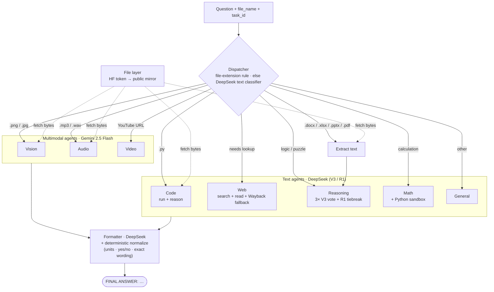
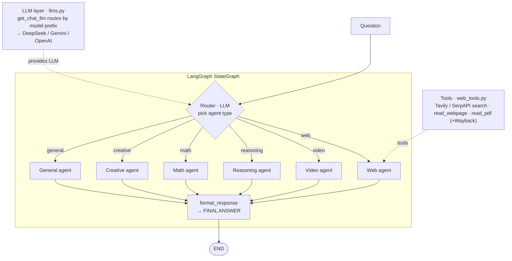

# Architecture

High-level architecture of the two GAIA solver implementations. Diagrams are
Mermaid — paste into [mermaid.live](https://mermaid.live) to export a PNG/SVG for
slides. Only the load-bearing components are shown.

---

## 1. `gaia_agent/` — current system (DeepSeek + Gemini, no OpenAI)

A question is routed by a **deterministic file-extension rule** (or a one-call
DeepSeek classifier for text), handled by one **specialist agent**, then passed
through a **formatter** that enforces the GAIA answer format. Text agents run on
**DeepSeek** (no rate limit → concurrency); multimodal agents on **Gemini**
(the only multimodal provider).

**Key ideas:** capability-based provider split (DeepSeek=text, Gemini=multimodal);
reasoning uses a self-consistency **vote** to fight LLM non-determinism; two-tier
async concurrency (text 8 / multimodal 4) keeps latency low and stays inside the
Gemini free-tier RPM.

---

## 2. `langgraph_ver/` — original system (LangGraph StateGraph)

A **LangGraph state machine**: an LLM **router** picks one agent type via
conditional edges; the chosen specialist runs; `format_response` emits the final
answer. A separate **LLM layer** (`llms.py`) chooses the backend per call, and a
**tools layer** (`web_tools.py`) provides search/read utilities.

**Key ideas:** declarative graph with one router and a fan-out of specialist
nodes; provider chosen centrally by model-name prefix; reusable web tools. This
is the codebase the new system grew out of (and still reuses `web_tools.py`).

---

## 3. What changed (old → new)

| Aspect | `langgraph_ver` (old) | `gaia_agent` (new) |
|--------|----------------------|--------------------|
| Orchestration | LangGraph StateGraph | plain async (lighter, easier concurrency) |
| Input | text query only | text **+ file/attachment + task_id** |
| Routing | LLM router only | **file-extension rule first**, LLM classifier for text |
| Modalities | web / reasoning / math / video | **+ vision, audio, code, document QA** (7 total) |
| Reasoning | single call | **3× self-consistency vote + R1 tiebreak** |
| Providers | OpenAI + DeepSeek + Gemini | **DeepSeek + Gemini only (no OpenAI)** |
| Concurrency | sequential per question | **two-tier async** (text / multimodal) |

Both feed the same downstream contract: a single `FINAL ANSWER: …` line. The new
system is wired into `app.py` (the HF Space submission entry point).
